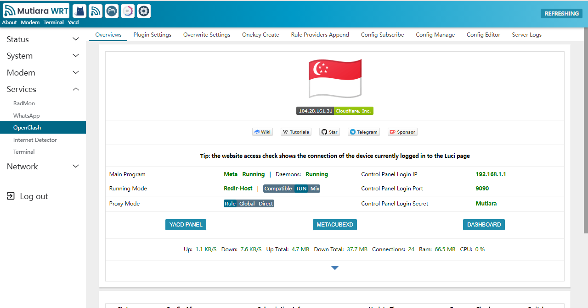

  
  <h1>OpenClash Mod Version</h1>

  
  
  

* Disclaimer! This is an unofficial openclash version
* For the official version click here [@vernesong/OpenClash](https://github.com/vernesong/OpenClash)

